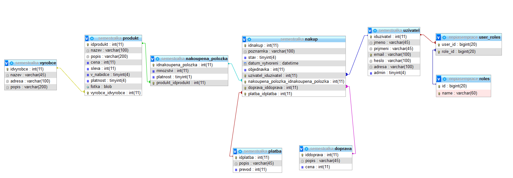

# NNPIA Semestrální práce - eshop

Jednoduchý eshop vytvořený za účelem získání zápočtu z přemětu NNPIA

## Použité technologie

* Java Spring boot
* React    
* Marian DB
* Potřebné závisloti a pluginy: 
    *org.springframework.boot 
    *org.springframework.security 
    *javax.validation 
    *org.springframework.boot 
    *mysql 
    *junit 
    *org.codehaus.groovy 
    *commons-beanutils 
    *org.codehaus.mojo 
    *org.apache.commons 
    *io.jsonwebtoken 
    *org.hibernate 
    *org.seleniumhq.selenium 
    *com.vaadin.external.google 
    *maven-resources-plugin 

Změny v pracovních adresářích
* ${project.basedir}/src/main/frontend
* ${basedir}/src/main/resources/static
* ${basedir}/src/main/frontend/build

## Technické požadavky
Pro vývoj bylo použito vývojové prostředí IntelliJ IDEA a Xampp. Funkčnost při použití jiných technologií nejde zaručit.

Pro funkčnost aplikace je potřeba nejprve spustit SQL dotazy,
které jsou uloženy v [data.sql](src/main/resources/data.sql).

Přihlašovací údaje výchozího administratora

* jméno: root
* heslo: root

## Potřebné údaje pro spuštění

Před spuštěním aplikace je potřeba spustit databázi a vytvořit v ní databázi pro eshop.
Dále je potřeba v datbázi nastavit přihlašovací údaje. Tyto údaje a jméno databáze je 
nutno změnit v [application.properties](src/main/resources/application.properties).

Po úspěšném spuštění backendu je potřeba spustit frontend.

Ve složce frontendu [frontend](src/main/frontend) je potřeba spustit tento příkaz:

### `npm start`

Ve vývojovém režimu aplikace poběží na adrese [http://localhost:3000](http://localhost:3000).
Na tuto adresu přejděte ve Svém prohlížeči.

API backendu aplikace je dostupné na adrese [http://localhost:8080](http://localhost:8080).

## Databázový model

## Základní popsání API

Základní adresy API jsou tyto:

* /api/
* /static/
* /signup/
* /home/
* /produkt/
* /doprava/
* /vyrobce/
* /platba/
* /cart/
* /nakup/

Význami API jsou samovysvětlující. Každé API má poté podrobnější
adresy a pro něj jsou nastaveny různé autentizační požadavky.

## Nasazená aplikace

Aplikace je nasazena na webu heroku a ****. Pro frontend je použit web **** a 
pro backend je použito heroku.

Web je dotstupný na adrese: [***]()

pokracovani priste a take kontrola